> 学习资料：Stanford CS223A《Introduction to Robotics》第1至3讲  
主要内容：自由度、广义坐标、坐标系、旋转矩阵、平移、齐次变换、欧拉角、轴角和欧拉参数
>
> 参考：机械臂运动学教程
>
> 1. [机械臂运动学教程：第1集](https://www.bilibili.com/video/BV1oa4y1v7TY/?p=1)
> 2. [机械臂运动学教程：第2集](https://www.bilibili.com/video/BV1oa4y1v7TY/?p=2)
> 3. [机械臂运动学教程：第3集](https://www.bilibili.com/video/BV1oa4y1v7TY/?p=3)
>

---

# 一、学习目标
通过本章学习，需要掌握以下内容：

1. 理解自由度、广义坐标、关节空间和操作空间。
2. 理解坐标系在机器人学中的作用。
3. 掌握点在不同坐标系中的表示方法。
4. 掌握旋转矩阵的含义和基本性质。
5. 区分坐标映射和主动旋转。
6. 掌握平移与旋转的组合。
7. 掌握齐次变换矩阵的使用方法。
8. 掌握多个坐标变换的组合与逆变换。
9. 了解欧拉角、轴角和欧拉参数等姿态表示方法。

---

# 二、空间位姿描述概述
机器人通常由基座、关节、连杆和末端执行器组成。旋转关节使用角度 $ \theta $ 描述，移动关节使用位移 $ d $ 描述。

描述机器人完整构型所需的独立参数数量称为自由度。全部关节变量组成广义坐标：

$$
q=
\begin{bmatrix}
q_1&q_2&\cdots&q_n
\end{bmatrix}^T
$$

使用关节变量描述机器人的空间称为关节空间；使用末端执行器位置和姿态描述机器人的空间称为操作空间。两者通过运动学关联：

$ X=f(q) $

机器人系统中通常同时存在基座、关节和末端执行器等多个坐标系。同一个点在不同坐标系中的坐标数值可能不同，因此需要进行坐标变换。

刚体的完整位姿由位置和姿态组成：

```latex
位姿 = 位置 + 姿态
```

位置通常使用三维向量表示，姿态可以使用旋转矩阵、欧拉角、轴角或欧拉参数表示。将旋转矩阵 $ R $ 和平移向量 $ p $ 组合，可以得到齐次变换矩阵：

$$
T=
\begin{bmatrix}
R&p\\
0&1
\end{bmatrix}
$$

后续内容将分别介绍旋转矩阵、平移、齐次变换以及常见的姿态表示方法。

---

# 三、旋转矩阵
## 3.1 旋转矩阵的含义
假设存在两个坐标系：

```latex
{A}
{B}
```

坐标系 `{B}` 相对于坐标系 `{A}` 的旋转矩阵记为：

$ {}^A_B R $

它可以将使用坐标系 `{B}` 表示的向量转换成使用坐标系 `{A}` 表示：

$ {}^A P={}^A_B R\,{}^B P $

其中：

+ $ {}^B P $表示点或向量在坐标系`{B}`中的坐标；
+ $ {}^A P $表示同一个点或向量在坐标系`{A}`中的坐标；
+ $ {}^A_B R $表示`{B}`相对于`{A}`的旋转关系。

---

## 3.2 旋转矩阵的组成
旋转矩阵可以写成：

$$
{}^A_B R=
\begin{bmatrix}
|&|&|\\
{}^A\hat{X}_B&{}^A\hat{Y}_B&{}^A\hat{Z}_B\\
|&|&|
\end{bmatrix}
$$

三列分别表示：

1. `{B}`的X轴在`{A}`中的方向；
2. `{B}`的Y轴在`{A}`中的方向；
3. `{B}`的Z轴在`{A}`中的方向。

展开后为：

$$
R=
\begin{bmatrix}
r_{11}&r_{12}&r_{13}\\
r_{21}&r_{22}&r_{23}\\
r_{31}&r_{32}&r_{33}
\end{bmatrix}
$$

旋转矩阵的每个元素都可以理解为两个坐标轴单位向量的点积，因此旋转矩阵也称为方向余弦矩阵。

例如：

$ r_{11}={}^A\hat{X}\cdot{}^B\hat{X} $

---

## 3.3 旋转矩阵的约束
旋转矩阵包含9个元素，但三维旋转只有3个自由度。

这是因为旋转矩阵的三个列向量必须满足：

### 每个列向量长度为1
$ \|r_1\|=\|r_2\|=\|r_3\|=1 $

### 不同列向量互相垂直
$ r_1^Tr_2=0 $

$ r_1^Tr_3=0 $

$ r_2^Tr_3=0 $

因此：

$ R^TR=I $

合法的三维旋转矩阵还需要满足：

$ \det(R)=1 $

---

## 3.4 旋转矩阵的逆
由于旋转矩阵是正交矩阵，因此：

$ R^{-1}=R^T $

如果：

$ {}^A P={}^A_B R\,{}^B P $

那么反向变换为：

$$
{}^B P=
\left({}^A_B R\right)^T{}^A P
$$

因此：

$$
{}^B_A R=
\left({}^A_B R\right)^T
$$

---

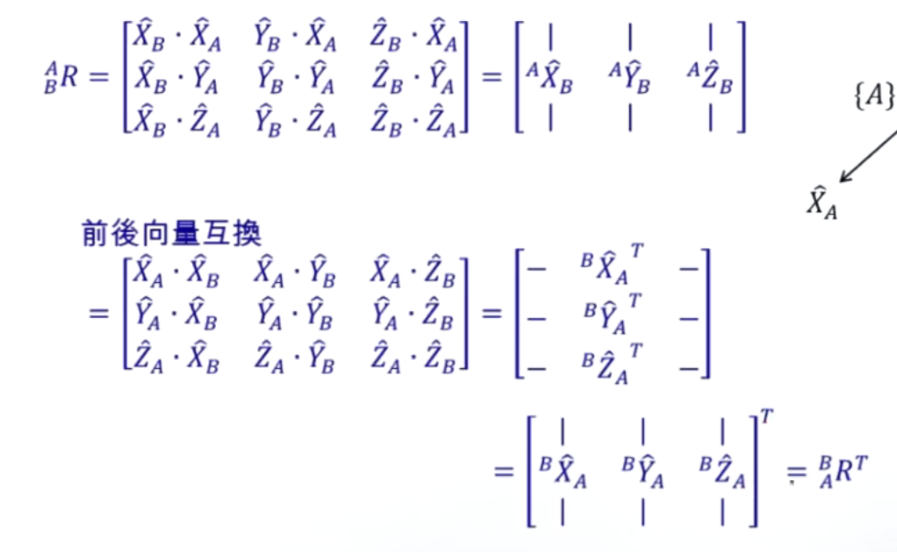

图：矩阵互换证明

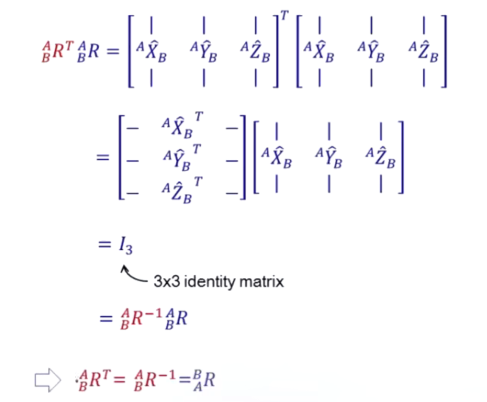

图：相乘得到单位矩阵I3

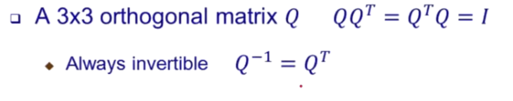

图：特别的矩阵：正交矩阵

# 四、绕坐标轴旋转
## 4.1 绕X轴旋转
绕X轴旋转 $ \theta $ 的旋转矩阵为：

$$
R_X(\theta)=
\begin{bmatrix}
1&0&0\\
0&\cos\theta&-\sin\theta\\
0&\sin\theta&\cos\theta
\end{bmatrix}
$$

绕X轴旋转时：

+ X坐标保持不变；
+ Y坐标和Z坐标发生变化。

---

## 4.2 绕Y轴旋转
$$
R_Y(\theta)=
\begin{bmatrix}
\cos\theta&0&\sin\theta\\
0&1&0\\
-\sin\theta&0&\cos\theta
\end{bmatrix}
$$

绕Y轴旋转时：

+ Y坐标保持不变；
+ X坐标和Z坐标发生变化。

---

## 4.3 绕Z轴旋转
$$
R_Z(\theta)=
\begin{bmatrix}
\cos\theta&-\sin\theta&0\\
\sin\theta&\cos\theta&0\\
0&0&1
\end{bmatrix}
$$

绕Z轴旋转时：

+ Z坐标保持不变；
+ X坐标和Y坐标发生变化。

---

## 4.4 旋转方向
旋转的正方向按照右手定则判断：

1. 右手大拇指指向旋转轴正方向；
2. 其余四指弯曲方向就是旋转正方向。

公式中的角度通常使用弧度。

角度转换为弧度：

$$
\theta_{\text{rad}}
=
\theta_{\text{degree}}\frac{\pi}{180}
$$

---

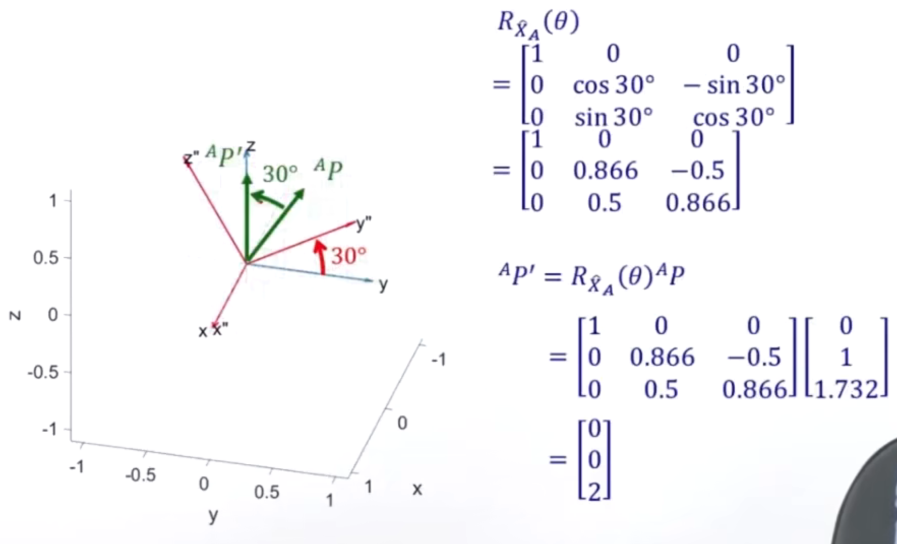

图：通过旋转矩阵进行旋转

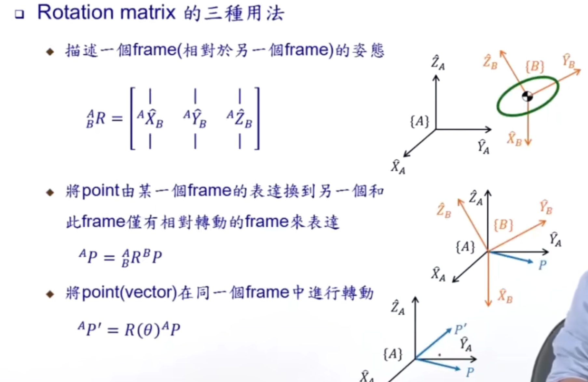

图：通过旋转矩阵旋转方式

# 五、坐标映射与旋转操作
旋转矩阵可以表示两种不同的过程。

## 5.1 坐标映射
空间中的向量保持不动，只改变描述这个向量的坐标系。

```latex
同一个向量
从坐标系B的表示
转换为坐标系A的表示
```

公式为：

$ {}^A P={}^A_B R\,{}^B P $

---

## 5.2 主动旋转
坐标系保持不动，空间中的向量真正发生旋转。

```latex
向量P₁经过旋转
得到向量P₂
```

公式为：

$ P_2=RP_1 $

---

## 5.3 两者的区别
| 类型 | 坐标系 | 向量 |
| --- | --- | --- |
| 坐标映射 | 改变描述坐标系 | 实际向量不动 |
| 主动旋转 | 坐标系不动 | 实际向量发生旋转 |


虽然两种情况可能使用形式相同的矩阵，但物理含义不同。

使用旋转矩阵前，应先确定：

1. 坐标系是否发生变化；
2. 向量是否发生实际旋转；
3. 矩阵表示从哪个坐标系到哪个坐标系。

---

# 六、平移与旋转
## 6.1 纯平移
如果两个坐标系的方向完全相同，只是原点位置不同，那么两个坐标系之间只存在平移。

设坐标系 `{B}` 的原点在坐标系 `{A}` 中的位置为：

$ {}^A P_{Borg} $

点 `P` 的坐标关系为：

$ {}^A P={}^B P+{}^A P_{Borg} $

这个公式成立的条件是：

```latex
{A}和{B}的坐标轴方向完全相同
```

---

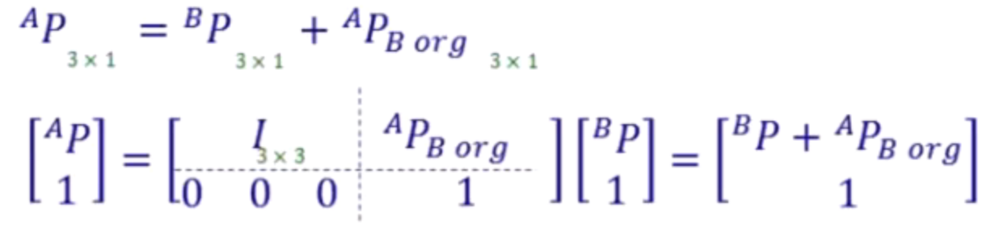

图：平移演示

## 6.2 旋转与平移组合
如果两个坐标系之间同时存在旋转和平移，则需要先处理坐标方向，再处理原点位置。

设：

+ 点`P`在坐标系`{B}`中的坐标为$ {}^B P $；
+ 坐标系`{B}`相对于`{A}`的旋转矩阵为$ {}^A_B R $；
+ `{B}`原点在`{A}`中的位置为$ {}^A P_{Borg} $。

那么：

$$
{}^A P=
{}^A_B R\,{}^B P+
{}^A P_{Borg}
$$

计算过程为：

```latex
B坐标中的点
    ↓
旋转到A坐标方向
    ↓
加上B坐标系原点在A中的位置
    ↓
得到点在A坐标系中的坐标
```

---

注：旋转见十二：固定角与欧拉角

# 七、齐次坐标与齐次变换
## 7.1 齐次坐标
为了用一次矩阵乘法同时表示旋转和平移，可以给三维坐标增加一个元素。

普通三维点：

$$
P=
\begin{bmatrix}
x\\
y\\
z
\end{bmatrix}
$$

对应的齐次坐标为：

$$
\bar{P}=
\begin{bmatrix}
x\\
y\\
z\\
1
\end{bmatrix}
$$

方向向量的齐次坐标通常写成：

$$
\bar{v}=
\begin{bmatrix}
v_x\\
v_y\\
v_z\\
0
\end{bmatrix}
$$

两者最后一个元素不同：

| 对象 | 最后一个元素 | 是否受平移影响 |
| --- | ---: | ---: |
| 空间中的点 | 1 | 是 |
| 方向向量 | 0 | 否 |


方向向量只表示方向和大小，不表示具体位置，所以不受平移影响。

---

## 7.2 齐次变换矩阵
齐次变换矩阵写成：

$$
{}^A_B T=
\begin{bmatrix}
{}^A_B R&{}^A P_{Borg}\\
0\quad0\quad0&1
\end{bmatrix}
$$

展开为：

$$
{}^A_B T=
\begin{bmatrix}
r_{11}&r_{12}&r_{13}&p_x\\
r_{21}&r_{22}&r_{23}&p_y\\
r_{31}&r_{32}&r_{33}&p_z\\
0&0&0&1
\end{bmatrix}
$$

其中：

```latex
左上角3×3部分：旋转矩阵
右上角3×1部分：平移向量
最后一行：齐次坐标结构
```

使用齐次变换矩阵后，旋转和平移可以合并为一次矩阵乘法：

$$
{}^A\bar{P}
=
{}^A_B T\,{}^B\bar{P}
$$

---


图：单纯平移

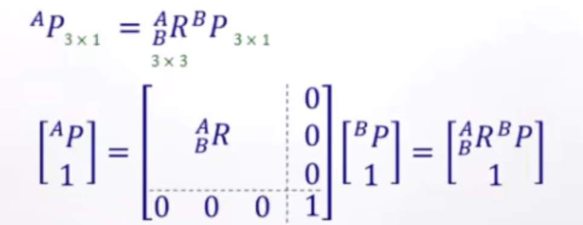

图：单纯旋转

## 7.3 计算示例
假设坐标系 `{B}`：

+ 相对于`{A}`绕Z轴旋转90°；
+ `{B}`原点在`{A}`中的位置为`(1,2,0)`。

旋转矩阵为：

$$
{}^A_B R=
\begin{bmatrix}
0&-1&0\\
1&0&0\\
0&0&1
\end{bmatrix}
$$

平移向量为：

$$
{}^A P_{Borg}=
\begin{bmatrix}
1\\
2\\
0
\end{bmatrix}
$$

齐次变换矩阵为：

$$
{}^A_B T=
\begin{bmatrix}
0&-1&0&1\\
1&0&0&2\\
0&0&1&0\\
0&0&0&1
\end{bmatrix}
$$

某个点在坐标系 `{B}` 中为：

$$
{}^B\bar{P}=
\begin{bmatrix}
1\\
0\\
0\\
1
\end{bmatrix}
$$

转换到坐标系 `{A}`：

$$
{}^A\bar{P}
=
{}^A_B T\,{}^B\bar{P}
$$

计算结果为：

$$
{}^A\bar{P}=
\begin{bmatrix}
1\\
3\\
0\\
1
\end{bmatrix}
$$

所以该点在坐标系 `{A}` 中的位置为：

```latex
(1,3,0)
```

---

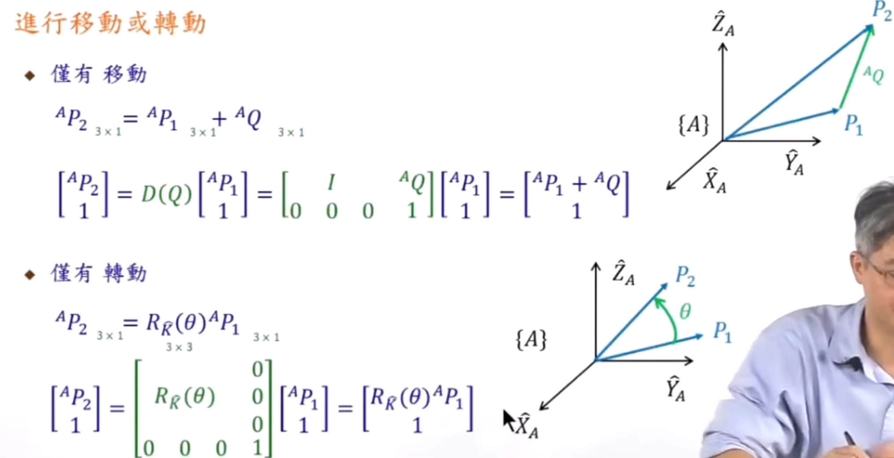

图：作为算子对向量进行处理

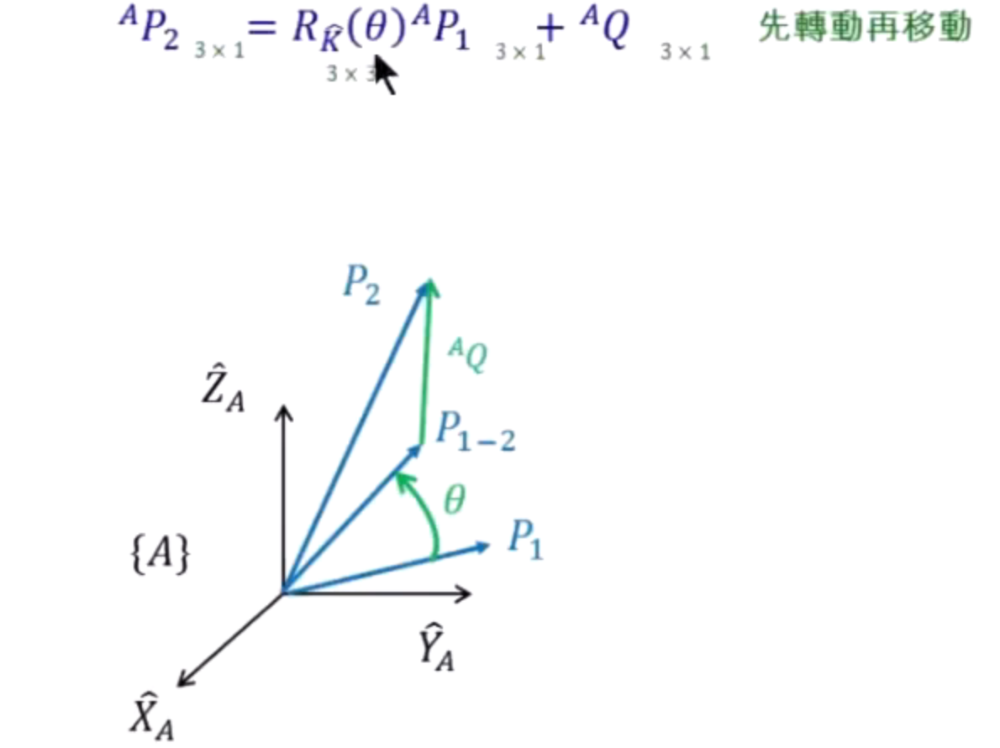

图：算子复合处理：先转动后移动

# 八、复合坐标变换
## 8.1 多个坐标系
假设存在三个坐标系：

```latex
{A} → {B} → {C}
```

已知：

$ {}^A_B T $

和：

$ {}^B_C T $

坐标系 `{C}` 相对于 `{A}` 的变换为：

$$
{}^A_C T
=
{}^A_B T\,{}^B_C T
$$

点的坐标变换为：

$$
{}^A P
=
{}^A_B T\,{}^B_C T\,{}^C P
$$

---

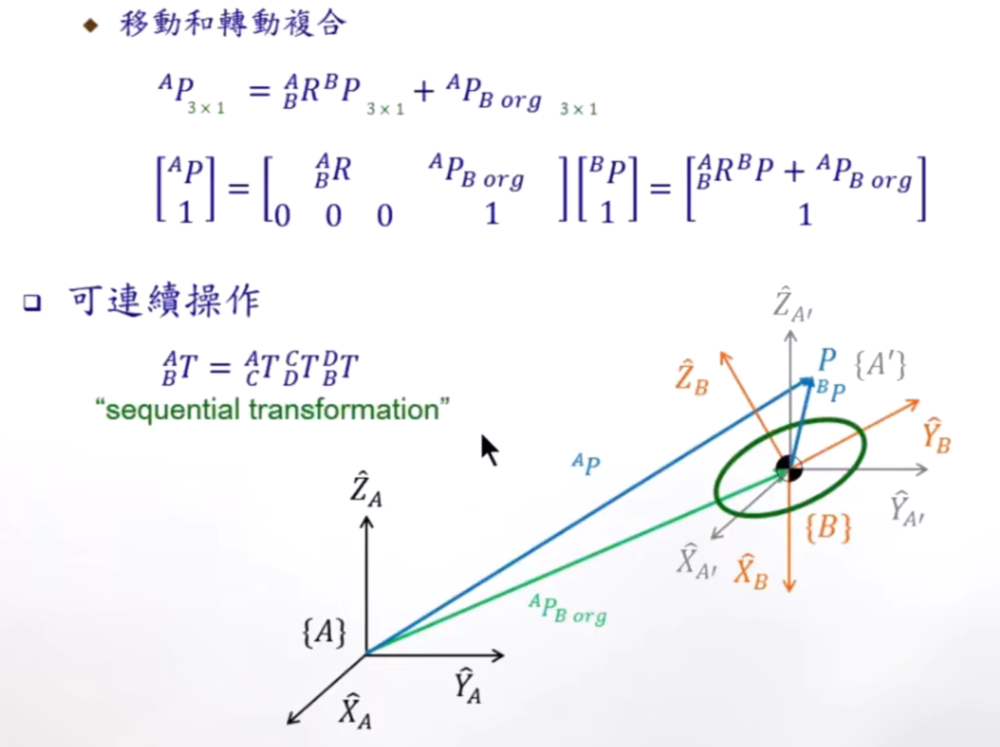

图：变换方式

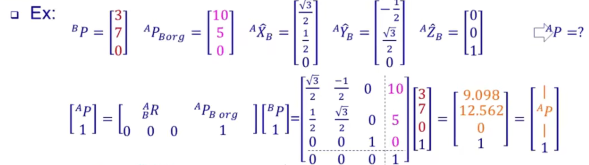

图：实例演示

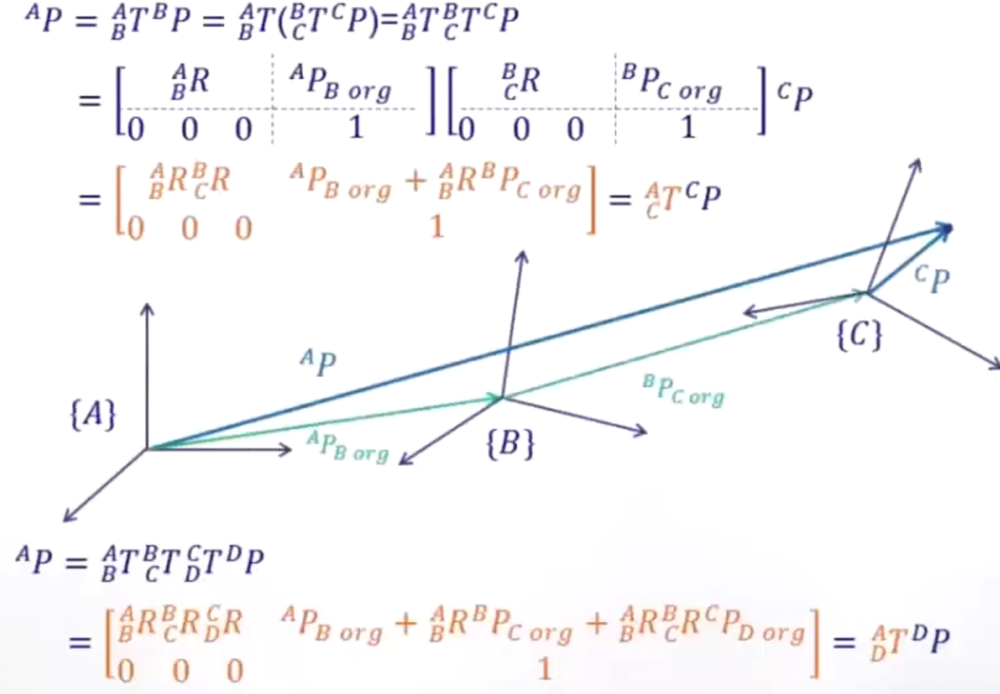

图：矩阵连乘解析

## 8.2 判断矩阵相乘顺序
可以检查相邻的坐标系标记能否连接。

例如：

$ {}^A_B T\,{}^B_C T $

中间的`B`能够连接，最后得到：

$ {}^A_C T $

可以按照下面的顺序理解：

```latex
点最初在C坐标系中
        ↓
通过B←C变换
转换到B坐标系
        ↓
通过A←B变换
转换到A坐标系
```

---

## 8.3 矩阵乘法不可交换
通常：

$ T_1T_2\neq T_2T_1 $

例如：

```latex
先旋转再平移
```

和：

```latex
先平移再旋转
```

得到的结果通常不同。

因此，不能随意交换两个变换矩阵的位置。

---

# 九、齐次变换的逆
已知齐次变换矩阵：

$$
T=
\begin{bmatrix}
R&p\\
0&1
\end{bmatrix}
$$

它的逆矩阵为：

$$
T^{-1}
=
\begin{bmatrix}
R^T&-R^Tp\\
0&1
\end{bmatrix}
$$

因此：

$$
{}^B_A T=
\left({}^A_B T\right)^{-1}
$$

需要注意，逆变换中的平移部分不是简单的`-p`，而是：

$ -R^Tp $

这是因为平移向量也需要转换到新的坐标方向中。

---

## 9.1 验证逆变换
变换矩阵与其逆矩阵相乘，应当得到单位矩阵：

$ TT^{-1}=I $

单位齐次变换矩阵为：

$$
I=
\begin{bmatrix}
1&0&0&0\\
0&1&0&0\\
0&0&1&0\\
0&0&0&1
\end{bmatrix}
$$

单位变换表示：

```latex
没有旋转
没有平移
```

---

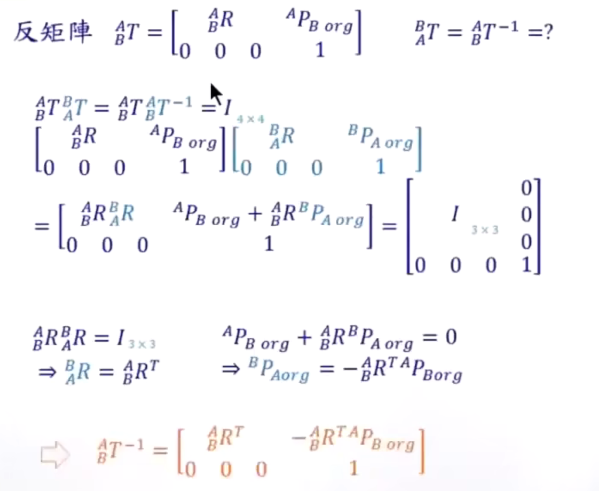

图：逆矩阵变换演示

# 十、末端执行器构型
末端执行器的完整构型包括位置和姿态：

$$
X=
\begin{bmatrix}
X_P\\
X_R
\end{bmatrix}
$$

其中：

+ $ X_P $表示末端执行器的位置；
+ $ X_R $表示末端执行器的姿态。

末端执行器相对于机器人基座的变换可以写成：

$ {}^B_E T $

其中：

+ `B`表示机器人基座坐标系；
+ `E`表示末端执行器坐标系。

齐次变换矩阵同时给出了：

1. 末端执行器原点的位置；
2. 末端执行器三个坐标轴的方向。

---

# 十一、姿态表示方法
三维旋转只有3个自由度，但可以使用多种方式表示。

| 表示方法 | 参数数量 | 特点 |
| --- | ---: | --- |
| 旋转矩阵 | 9 | 计算直接，但具有6个约束 |
| 固定角 | 3 | 围绕固定坐标轴旋转 |
| 欧拉角 | 3 | 围绕变化后的坐标轴旋转 |
| 轴角 | 4 | 使用单位旋转轴和旋转角 |
| 欧拉参数 | 4 | 没有欧拉角的万向节锁，需要单位约束 |


不同表示方法适合不同的计算场景。

---

# 十二、固定角与欧拉角
## 12.1 固定角
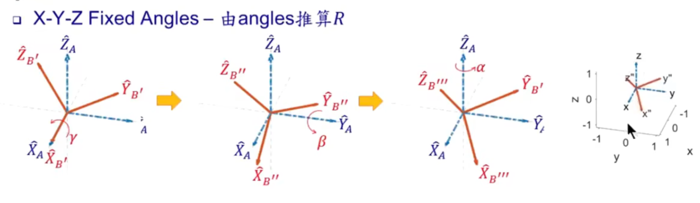

图：旋转


图：利用连乘解决多次相对旋转

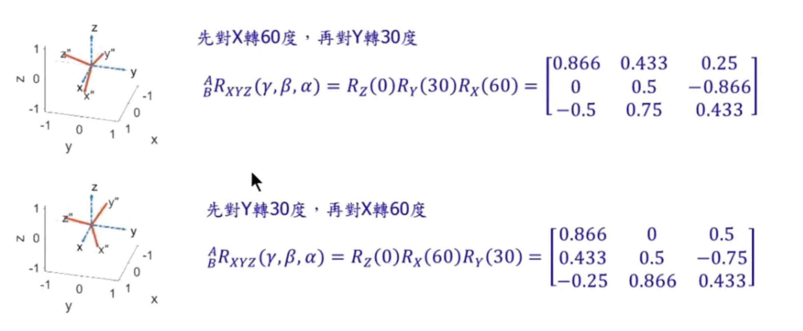

图：旋转顺序不同作用效果不同

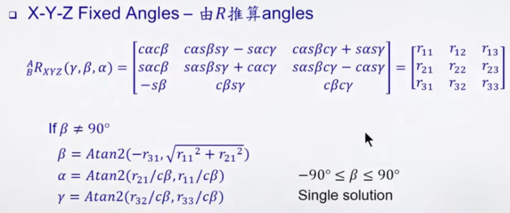

图：反解公式

固定角的每一次旋转都围绕固定参考坐标系的轴进行。

例如，X-Y-Z固定角表示：

1. 绕固定X轴旋转；
2. 绕固定Y轴旋转；
3. 绕固定Z轴旋转。

组合矩阵可以写成：

$$
R=
R_Z(\alpha)
R_Y(\beta)
R_X(\gamma)
$$

矩阵最右侧的旋转最先作用于向量。

---

## 12.2 欧拉角
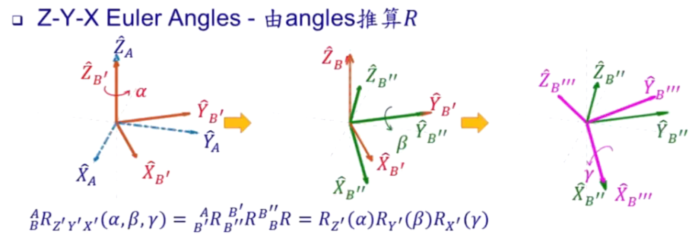

图：欧拉角旋转

欧拉角的每一次旋转都围绕旋转后产生的新坐标轴进行。

讲义重点介绍Z-Y-X欧拉角：

$$
R=
R_Z(\alpha)
R_Y(\beta)
R_X(\gamma)
$$

通常可以对应为：

| 角度 | 常用名称 | 旋转轴 |
| --- | --- | --- |
| $ \gamma $ | Roll | X轴 |
| $ \beta $ | Pitch | Y轴 |
| $ \alpha $ | Yaw | Z轴 |


需要注意，固定角和欧拉角即使写出相同形式的矩阵，也可能具有不同的旋转过程解释。

---

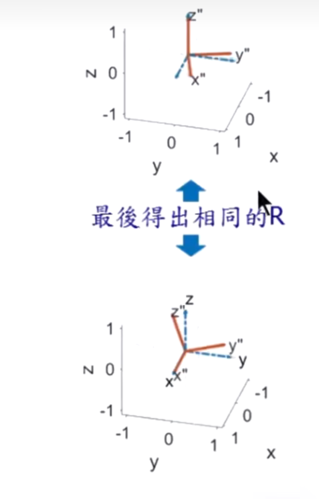

图：ZYXframe和XYZfixed转动结果一样（角度需要调换）

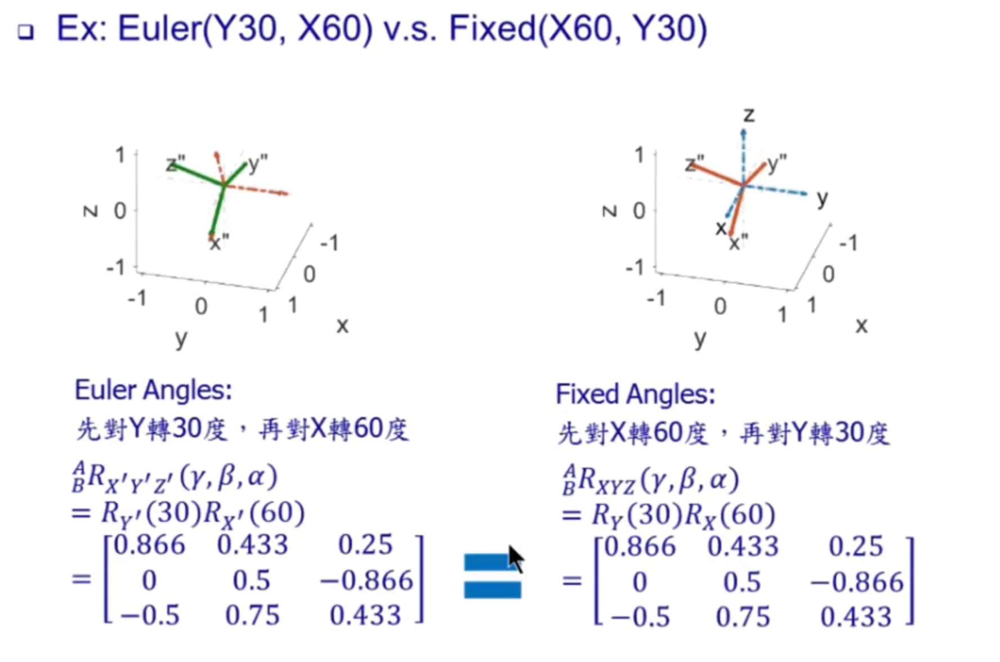

图：例子验证

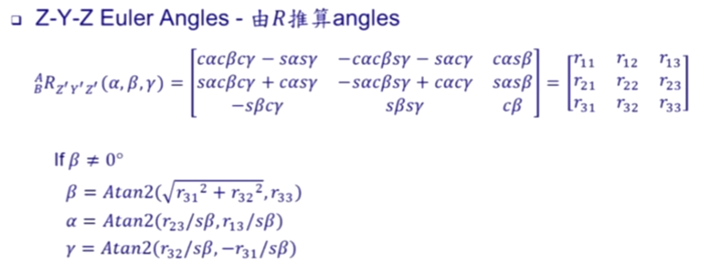

图：反解公式

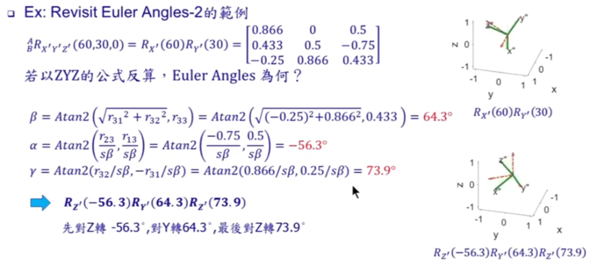

图：zyz转法和xyz转法的等效处理

## 12.3 使用角度表示时需要确认的内容
使用欧拉角或固定角之前，需要明确：

1. 旋转轴顺序；
2. 使用固定轴还是运动轴；
3. 使用主动旋转还是坐标映射；
4. 角度使用度数还是弧度；
5. 矩阵采用左乘还是右乘。

如果这些约定不明确，相同的三个角度可能得到不同的旋转结果。

---

# 十三、欧拉角奇异点
对于Z-Y-X欧拉角，当：

$ \cos\beta=0 $

也就是：

$ \beta=\pm90^\circ $

会出现姿态表示奇异。

此时第一和第三个旋转轴发生重合，不能分别确定 $ \alpha $ 和 $ \gamma $。

只能确定：

```latex
α + γ
```

或者：

```latex
α - γ
```

这种现象称为：

```latex
万向节锁
Gimbal Lock
```

需要注意：

> 欧拉角发生奇异不代表真实姿态不存在，而是这种参数表示方法不能在该位置唯一描述姿态。
>

---

# 十四、轴角表示
## 14.1 基本概念
轴角表示使用：

+ 一个单位旋转轴；
+ 一个旋转角度。

单位旋转轴为：

$$
K=
\begin{bmatrix}
k_x\\
k_y\\
k_z
\end{bmatrix}
$$

并且满足：

$ \|K\|=1 $

旋转角度为：

$ \theta $

因此，一个旋转可以描述为：

```latex
绕单位轴K旋转θ
```

---

## 14.2 Rodrigues旋转公式
轴角对应的旋转矩阵为：

$$
R=
\cos\theta I
+
(1-\cos\theta)KK^T
+
\sin\theta[K]_\times
$$

其中：

$$
[K]_\times=
\begin{bmatrix}
0&-k_z&k_y\\
k_z&0&-k_x\\
-k_y&k_x&0
\end{bmatrix}
$$

`[K]×`是旋转轴向量对应的反对称矩阵。

---

## 14.3 从旋转矩阵求旋转角
旋转角可以通过旋转矩阵的迹求得：

$$
\theta=
\arccos
\left(
\frac{r_{11}+r_{22}+r_{33}-1}{2}
\right)
$$

当：

$ \sin\theta\neq0 $

旋转轴可以写成：

$$
K=
\frac{1}{2\sin\theta}
\begin{bmatrix}
r_{32}-r_{23}\\
r_{13}-r_{31}\\
r_{21}-r_{12}
\end{bmatrix}
$$

当 $ \sin\theta=0 $ 时，不能直接使用该公式，需要单独处理。

---

# 十五、欧拉参数
## 15.1 欧拉参数的定义
设旋转轴为：

$$
K=
\begin{bmatrix}
k_x\\
k_y\\
k_z
\end{bmatrix}
$$

旋转角度为 $ \theta $。

欧拉参数定义为：

$$
\epsilon_1=
k_x\sin\frac{\theta}{2}
$$

$$
\epsilon_2=
k_y\sin\frac{\theta}{2}
$$

$$
\epsilon_3=
k_z\sin\frac{\theta}{2}
$$

$$
\epsilon_4=
\cos\frac{\theta}{2}
$$

前三个参数与旋转轴方向有关，第四个参数与旋转角度有关。

---

## 15.2 单位约束
欧拉参数必须满足：

$$
\epsilon_1^2+
\epsilon_2^2+
\epsilon_3^2+
\epsilon_4^2=1
$$

因此，四个欧拉参数并不是四个独立自由度。

三维旋转仍然只有3个自由度。

---

## 15.3 欧拉参数的特点
优点：

+ 不存在欧拉角的万向节锁；
+ 适合表示连续旋转；
+ 适合进行姿态插值；
+ 参数数量少于旋转矩阵。

注意事项：

+ 使用前需要归一化；
+ 一组欧拉参数及其整体相反数表示同一个旋转；
+ 四个参数不能直接当作四个旋转角理解。

---

# 十六、常见错误
## 16.1 忽略坐标系标记
只写：

$ P=RP $

无法判断输入和输出分别属于哪个坐标系。

更清楚的写法为：

$ {}^A P={}^A_B R\,{}^B P $

---

## 16.2 写反变换矩阵顺序
错误：

$$
{}^A_C T=
{}^B_C T{}^A_B T
$$

正确：

$$
{}^A_C T=
{}^A_B T{}^B_C T
$$

可以通过相邻坐标系标记能否连接进行检查。

---

## 16.3 把逆变换的平移直接写成负数
错误：

$$
T^{-1}=
\begin{bmatrix}
R^T&-p\\
0&1
\end{bmatrix}
$$

正确：

$$
T^{-1}=
\begin{bmatrix}
R^T&-R^Tp\\
0&1
\end{bmatrix}
$$

---

## 16.4 混淆度数和弧度
三角函数计算通常使用弧度：

$$
\theta_{\text{rad}}
=
\theta_{\text{degree}}\frac{\pi}{180}
$$

例如：

```latex
90° = π/2 rad
180° = π rad
360° = 2π rad
```

---

## 16.5 混淆旋转顺序
通常：

$$
R_ZR_YR_X
\neq
R_XR_YR_Z
$$

因此，只给出三个旋转角度是不完整的，还必须给出旋转顺序。

---

## 16.6 混淆点与方向向量
点的齐次坐标最后一项为：

```latex
1
```

方向向量最后一项为：

```latex
0
```

如果把方向向量错误地写成1，它会受到平移影响。

---

## 16.7 使用不合法的旋转矩阵
合法旋转矩阵需要满足：

$ R^TR=I $

以及：

$ \det(R)=1 $

仅仅是一个三行三列的矩阵，不代表它一定是旋转矩阵。

---

# 十七、核心公式总结
## 17.1 点的旋转变换
$ {}^A P={}^A_B R\,{}^B P $

## 17.2 旋转和平移组合
$$
{}^A P=
{}^A_B R\,{}^B P+
{}^A P_{Borg}
$$

## 17.3 齐次变换
$$
{}^A\bar{P}
=
{}^A_B T\,{}^B\bar{P}
$$

## 17.4 复合变换
$$
{}^A_C T=
{}^A_B T{}^B_C T
$$

## 17.5 旋转矩阵的逆
$ R^{-1}=R^T $

## 17.6 齐次变换的逆
$$
T^{-1}
=
\begin{bmatrix}
R^T&-R^Tp\\
0&1
\end{bmatrix}
$$

## 17.7 欧拉参数
$$
\epsilon=
\begin{bmatrix}
k_x\sin\frac{\theta}{2}\\
k_y\sin\frac{\theta}{2}\\
k_z\sin\frac{\theta}{2}\\
\cos\frac{\theta}{2}
\end{bmatrix}
$$

## 17.8 欧拉参数单位约束
$$
\epsilon_1^2+
\epsilon_2^2+
\epsilon_3^2+
\epsilon_4^2=1
$$

---

# 十八、知识关系总结
```latex
机器人构型
    ↓
自由度和广义坐标
    ↓
关节空间与操作空间
    ↓
位置和姿态
    │
    ├── 位置向量
    │
    └── 姿态
         ├── 旋转矩阵
         ├── 固定角
         ├── 欧拉角
         ├── 轴角
         └── 欧拉参数
    ↓
旋转矩阵R
    +
平移向量p
    ↓
齐次变换矩阵T
    ↓
复合变换与逆变换
```

---

# 十九、学习总结
空间位姿描述研究的是：

> 一个物体在哪里、朝向哪里，以及如何在不同坐标系之间转换它的位置和姿态。
>

位置可以使用三维向量描述，姿态可以使用旋转矩阵、欧拉角、轴角或欧拉参数描述。

旋转矩阵和平移向量可以组合成齐次变换矩阵：

$$
T=
\begin{bmatrix}
R&p\\
0&1
\end{bmatrix}
$$

齐次变换矩阵可以完成：

+ 点的坐标变换；
+ 坐标系之间的变换；
+ 多级变换的组合；
+ 正向变换和逆向变换。

掌握空间位姿描述后，可以继续学习：

+ 机械臂正运动学；
+ 机械臂逆运动学；
+ 雅可比矩阵；
+ 轨迹生成；
+ 机器人动力学；
+ 机器人控制。
